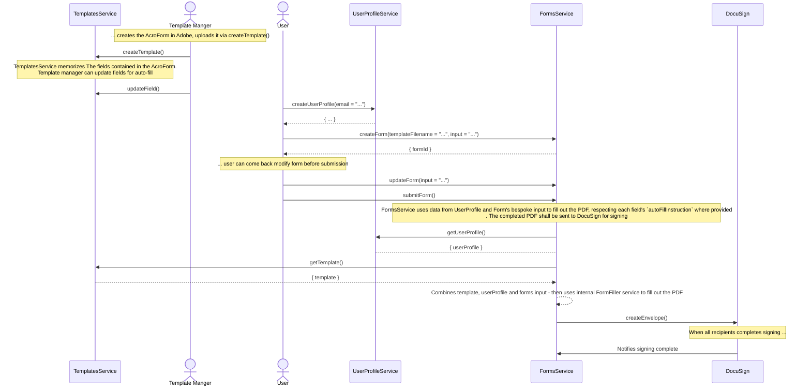

# docusandbox

This application demonstrates how to fill out a PDF and send it to DocuSign for signature

## Concepts

- `Template` - A template is a PDF file with an unfilled AcroForm
- `Form` - Each time someone attempts to fill out this PDF file, we copy the template and create a `Form` object
- `Envelope` - When the user fully fills out a `Form` (just prior to signature) we stick the `Form` into an DocuSign `Envelope` and send it off for signing

## Sequence Diagram

